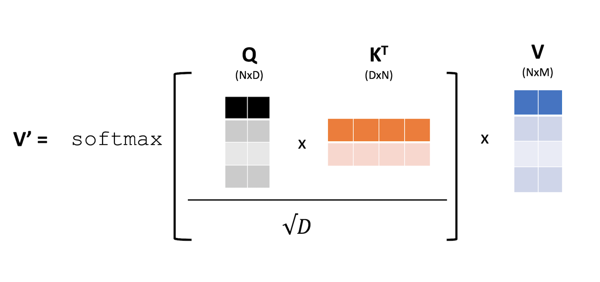
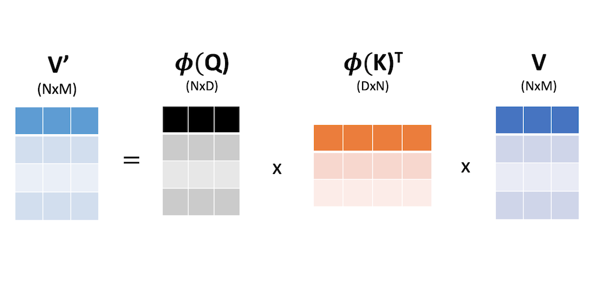
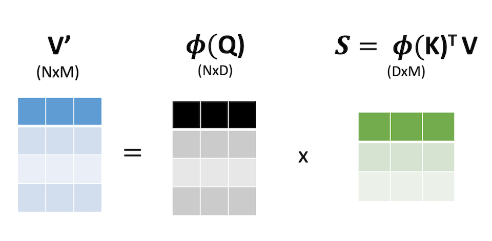
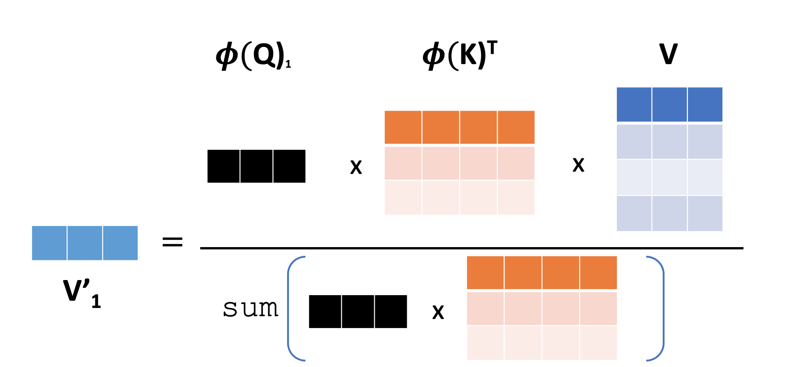
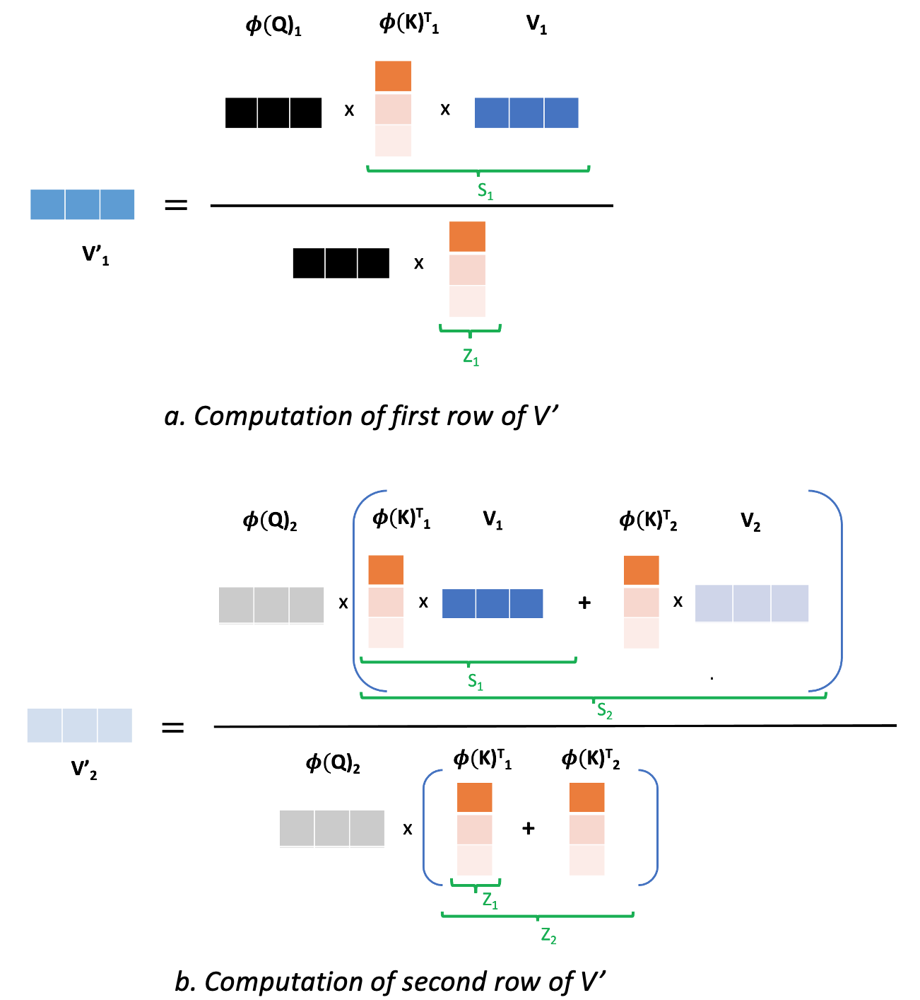

 Recently I came across this paper called Transformers are RNNs [1]. We all know that cannot be true- transformers were invented to overcome limintations of RNNs and are immensely powerful. So, what could this paper be about? As it turns out the authors are comparing the sequential autoregressive nature in which we can do inference in RNNs, we can do so with Transformers too with some simplifications. However, there is a more important theme to this paper: regarding linear approximation of the attention block, which lies at the heart of this paper. Without further ado, let's understand these fundamentals one by one.

# Linearization of Attention

Let's look at the attention layer. If $x$ is the input, it is first transformed into query, key and value as follows:

$$
Q = xW_Q
$$

$$
K = xW_K 
$$

$$
V = xW_V
$$
where $W_Q \in \mathbb{R}^{F \times D}$, $W_K \in \mathbb{R}^{F \times D}$ and $W_V \in \mathbb{R}^{F \times M}$ transform input sequence of dimension F (vocabulary size) to dimension $D$, $D$ and $M$ respectively. Then the attention is computed with the following equation:
$$
V' = \text{softmax} \bigg( \frac{QK^T}{\sqrt{D}} \bigg) V
$$

## Computational and Memory Complexity

Both the computational and memory complexity of attention is $\mathcal{O}(N^2)$. To understand why, simply look at the two matrix multiplications in attention in the following figure:

Inside softmax, we need to multiply a $N \times D$ matrix with $D \times N$, hence we need to do $N^2D$ operations. After softmax, we need to multiply $N \times N$ matrix with $N \times M$ matrix which is again $N^2M$ operations. Thus the computational complexity is $\mathcal{O}(N^2 \text{max}(M, D))$. Similarly, the memory complexity is $\mathcal{O}(N^2)$ because we need to store the $N \times N$ matrix before softmax.

Now, how can we improve this? The first thought that comes to mind is that of linearization. Suppose, we could get rid of softmax operation by transforming the matrices $Q$ and $K$ into some features by passing through a function $\phi$ such that we now get linear multiplication between two matrices. Suppose this function acts on rows of $Q$ and $K$, i.e. columns of $K^T$. This is represented in the figure below. Note that to hint the fact that application of $\phi$ could increase the row size of $Q$ and column size of $K^T$, we have increased them from 2 (in previous figure) to 3 in this figure.

If we could linearize like this, we could save a lot. For example, we could multiply the right two matrices with sizes $D \times N$ and $N \times M$ as shown below:

This operation has computational complexity of $\mathcal{O}(NDM)$ resulting into a matrix of size $D \times M$. Note that the complexity is $\mathcal{O}(N)$ if $D$ and $M$ are less compared to $N$. In practice, $N$ is quite large in the order of thousand while $D$ and $M$ are small in the order of 30. Hence, the asymptotic analysis makes sense. Similarly, in the next step, we multiply the first matrix with size $N \times D$ with this new matrix of size $D \times M$, which is again $\mathcal{O}(N)$. Therefore, overall compuatational complexity would be $\mathcal{O}(N)$ and memory complexity would also reduce to $\mathcal{O}(NM)$.

However, simply replacing softmax of matrix multiplication with another matrix multiplication is not a great idea. For one, softmax involves row normalization which is a critical component of attention; if we simply replace softmax with matrix multiplication, we lose that. Therefore, the authors of this paper[1] propose linearization and then normalization, which is an excellent idea.

# Linearization and Normalization
This paper[1] proposes linearization and then normalization. To understand that, first let's rewrite attention by expanding softmax

$$
V' = \frac{\text{exp}(QK^T)}{\text{rowsum} [\text{exp}(QK^T)]} V
$$

where exp is an element-wise exponential operation on the matrix $QK^T$ and the division is row-wise normalization of each row of the matrix $\text{exp}(QK^T)$. 

Now, instead of softmax, we can approximate the matrix $\text{exp}(QK^T)$ with $\phi(Q)\phi(K)^T$, and retain the rowwise normalization. That way, the attention matrix will always have rows summing to 1, which preserves a key property of softmax attention. At the same time, this linearization also enjoys benefits of reducing computational complexity.

With this approximation, now we can rewrite the attention block equation as follows:

$$
V' = \frac{\phi(Q) \phi(K)^T}{\text{rowsum} [\phi(Q) \phi(K)^T]} V
$$

This is slight abuse of notation, what we mean by the division line here is that each row of $\phi(Q) \phi(K)^T$ is divided by its corresponding rowsum. To make things more clear and accurate, it is perhaps better to look at the rows of $V'$ which looks like this:
$$
V'\_i = \frac{\phi(Q)\_i \phi(K)^T V}{\text{sum} [\phi(Q)\_i \phi(K)^T]}
$$

where $V'\_i$ and $\phi(Q)\_i$ denote $i^{th}$ rows of $V'$ and $\phi(Q)$ respectively. There is no ambiguity here because the denominator is a scalar, the sum of a row vector obtained by multiplying a row vector with a matrix. This is perhaps clearer with the following diagram:

This strategy does reduce the computational complexity and memory complexity to $\mathcal{O}(N)$ because we can compute $\phi(K)^T V$ in advance and for each $\phi(Q)\_i$ we have to do vector matrix computation that is $\mathcal{O}(DM)$. The overall complexity scales linearly with the number of rows in $\phi(Q)$ which is N. 

# Existence of Inner Product and Connection to Positive Definite Kernel
Okay, looks neat. But, what about the approximation, we said that we can do the following approximation

$$
\text{exp}(QK^T) \approx \phi(Q) \phi(K)^T
$$
Can we do that? 

The answer is yes, in some sense. This has some deep connection with the area called kernel methods and Reproducing Kernel Hilbert Space (RKHS). To understand this connection, let's investigate what is this matrix $\text{exp}(QK^T)$ anyway?

Let's say 

$$
H = \text{exp}(QK^T)
$$
The $(i, j)^{th}$ element of $H$ is $\text{exp}(<Q_i, K_j>)$, i.e. exponent of the inner product between $i^{th}$ row of $Q$ and $j^{th}$ column of $K^T$. There is a kernel that generates this matrix which takes two vectors $x,y$  and gives a scalar as follows:

$$
h(x, y) = \text{exp}(< x, y>)
$$
The fact that this is a kernel entails many things (see [2]). One thing that it entails is that it is positive definite. If it is a positive definite kernel, then we can always express a kernel as an inner product between two vectors in Hilbert space as follows:

$$
h(x, y) = <\phi(x), \phi(y)>
$$

where $\phi$ is a mapping that transforms $x$ from Euclidean space to the correct Hilbert space and then we take inner product in that space. Because of this deep connection between kernel and inner product in Hilbert space, we can, in fact, write the matrix $H$ as matrix multiplication as follows:

$$
H = \text{exp}(QK^T) \approx \phi (Q) \phi (K)^T
$$

where $\phi$ acts on each rows of matrices $Q,K$.

At this point I want to caution that it is one thing to say there exists an abstract Hilbert space where we can express a kernel as an inner product and a different thing to actually find such a space or the map $\phi$. In this paper [1], authors use $\phi$ defined as follows:
$$
\phi(x) = \text{elu}(x)+1
$$
which is not guaranteed to be the Hilbert space mapping we were talking about earlier. So even though replacing $H$ by product of two matrices somewhat makes sense, the mapping we get in practice is completely driven by the empirical performance of the approximate transformer obtained with linear attention.

Nevertheless, I find it intruguing that there is this connection between the attention and RKHS theory. This, perhaps, might lead to interesting ways to linearize the attention block in the future. I can already imagine a few of them right now.

# But, why are Transformers RNNs?
When the authors said "Transformers are RNN", they were referring to the sequential autoregressive inference in the RNNs. In RNNs, we can sequentially generate output in an autoregressive fashion. Each input token goes into the neural network block and comes out the output. It turns out that with the above linearization of attention, we can achieve something similar to RNNs in case of Transformers too, but only if we consider the causal attention.

## Causal Attention Leads to Recurrence
So far, we saw that linearization leads to efficiency in terms of memory and computation. But, if we were to consider causal attention, i.e. the attention that only looks at the previous tokens and nothing from the future, that combined with linearization buys us even more.

In causal attention, before we normalize, we mask out that pre-attention matrix with a lower triangular mask of ones as follows:

$$
H \approx \phi (Q) \phi (K)^T \odot L_{mask}
$$
where $\odot$ represents pointwise multiplication.
Because of this masking, we get a simpler and recurrent relation in computing $V'$. To understand that, let's revisit the expression for

$$
V'\_i = \frac{\phi(Q)\_i \phi(K)^T V}{\text{sum} [\phi(Q)\_i \phi(K)^T]}
$$

We know that the the matrix product $\phi(K)^T V$ can be expanded as an outer product like $\phi(K)^T V = \sum\_{j=1}^N\phi(K)^T\_j V\_j$,
where $\phi(K)^T\_j, V\_j$ simply represent $j^{th}$ column of $\phi(K)^T$ and row of $V$ respectively. Now, because of the masking, we don't need $N$ terms in expansion and as a result, to compute $V'\_i$, we just need $i$ terms in the outer product as follows:

$$
V'\_i = \frac{\phi(Q)\_i \sum\_{j=1}^i\phi(K)^T\_j V\_j}{\phi(Q)\_i \\sum\_{j=1}^i\phi(K)^T\_j}
$$

From here, we can also introduce the recurrent relation by defining $S$ and $Z$ as follows:
$$
S\_i = \sum\_{j=1}^i\phi(K)^T\_j V\_j = \phi(K)^T\_i V\_i + S\_{i-1}
$$

$$
Z\_i = \sum\_{j=1}^i\phi(K)^T\_j = \phi(K)^T\_i  + Z\_{i-1}
$$

This has been clearly illustrated in the following diagram:

## Clear Path from Front to End
The transformer architecture is such that it is a per token computation except for the attention block. So, in previous sections, we saw that we can compute output in one token basis from the attention block and it does not require any information about new token in the future. This clears the computation path from the front to the end of transformer because of the following reason:

1. The attention with previous tokens is handled by the recurrent relation of $Z$ and $S$ as shown before. Besides that there are skip connection, instance normalization and MLP that acts on each token independently. This consists of the whole attention layer.

2. Second layer takes the output of first layer and does the same computation. This layer has it's own $S$ and $Z$, but for $i^{th}$ token, we can calculate output of this layer from the output of previous layer as the input to this layer and previously saved $S$ and $Z$. This means we are clear to compute current $i^{th}$ output.

3. In this way, as new token comes, we can recurrenlty calculate output of each layer and pass to the next layer until it reaches that last layer where corresponding output is delivered. Hence, we can do overall Transformer decoding sequentially in a streaming fashion in linear computational complexity with respect to the number of tokens $N$. This is what makes the inference similar to RNNs, hence the title.

## References
1. Katharopoulos, A., Vyas, A., Pappas, N., & Fleuret, F. (2020, November). Transformers are RNNs: Fast autoregressive transformers with linear attention. In International conference on machine learning (pp. 5156-5165). PMLR.
2. Gretton, A. https://www.gatsby.ucl.ac.uk/~gretton/coursefiles/lecture4_introToRKHS.pdf
